<!-- Full-page holographic HUD. Edit text/roles/projects inside hologram.svg -->

◢ <b>CLICKABLE LINKS</b> &nbsp; [Portfolio](https://stevenwimberly.github.io) &nbsp;·&nbsp; [LinkedIn](https://linkedin.com/in/steven-wimberly-38854a222) &nbsp;·&nbsp; [Email](mailto:smw4789@my.utexas.edu) &nbsp;·&nbsp; [GitHub](https://github.com/stevenwimberly) &nbsp;·&nbsp; [EGSE_Board](https://github.com/stevenwimberly/EGSE_Board) &nbsp;·&nbsp; [flight_preparation_panel](https://github.com/stevenwimberly/flight_preparation_panel) &nbsp;·&nbsp; [Buzz](https://github.com/stevenwimberly/Buzz)

<b>◢ TEXT VERSION / FULL DETAILS</b>

 

**Steven Wimberly** — Electrical & Computer Engineering · UT Austin · Class of 2029
Hardware engineer — PCB design, embedded systems, and power electronics.

### Experience

| Role | Organization | Year |
|------|-------------|------|
| 🛰️ Electrical Power Systems Engineer | Texas Spacecraft Laboratory · UT Austin | Ongoing |
| 🤖 Robotics Engineering Intern | Kurtin Robotics | 2026 |
| 🔬 Research Intern | MIT Plasma Science & Fusion Center | 2024 |

### Currently Building

- ⚡ **Power Distribution Board** — synchronous buck (battery → 5 V / 3.3 V) with current sensing, for an autonomous drone
- 🖥️ **Pipelined RISC-V CPU** — RV32I core in SystemVerilog, targeting FPGA
- 🚁 **Autonomous Drone** — 3 custom PCBs (flight controller, power, sensor) + GPS autonomy

### Featured Work

- 🛰️ [EGSE_Board](https://github.com/stevenwimberly/EGSE_Board) — CubeSat ground-support electronics · TSL
- 🔌 [flight_preparation_panel](https://github.com/stevenwimberly/flight_preparation_panel) — CDH-to-EGSE signal routing board · TSL
- 🏙️ [Buzz](https://github.com/stevenwimberly/Buzz) — live campus crowd-level web app

### Tools & Technologies

**Hardware:** KiCad · LTspice · PCB design · soldering · oscilloscope
**Embedded:** C / C++ · ARM Cortex-M · STM32
**Digital:** SystemVerilog · Verilog *(learning)*
**Other:** Python · Git · Fusion 360

