# Steven Wimberly

**Electrical & Computer Engineering · UT Austin · Class of 2029**

Hardware engineer — PCB design, embedded systems, and power electronics.

---

## Experience

| Role | Organization | Year |
|------|-------------|------|
| 🛰️ Electrical Power Systems Engineer | Texas Spacecraft Laboratory · UT Austin | Ongoing |
| 🤖 Robotics Engineering Intern | Kurtin Robotics | 2026 |
| 🔬 Research Intern | MIT Plasma Science & Fusion Center | 2024 |

---

## Currently Building

- ⚡ **Power Distribution Board** — synchronous buck (battery → 5 V / 3.3 V) with current sensing, for an autonomous drone
- 🖥️ **Pipelined RISC-V CPU** — RV32I core in SystemVerilog, targeting FPGA
- 🚁 **Autonomous Drone** — 3 custom PCBs (flight controller, power, sensor) + GPS autonomy

---

## Featured Work

- 🛰️ [EGSE_Board](https://github.com/stevenwimberly/EGSE_Board) — CubeSat ground-support electronics · TSL
- 🔌 [flight_preparation_panel](https://github.com/stevenwimberly/flight_preparation_panel) — CDH-to-EGSE signal routing board · TSL
- 🏙️ [Buzz](https://github.com/stevenwimberly/Buzz) — live campus crowd-level web app

---

## Tools & Technologies

**Hardware:** KiCad · LTspice · PCB design · soldering · oscilloscope
**Embedded:** C / C++ · ARM Cortex-M · STM32
**Digital:** SystemVerilog · Verilog *(learning)*
**Other:** Python · Git · Fusion 360
